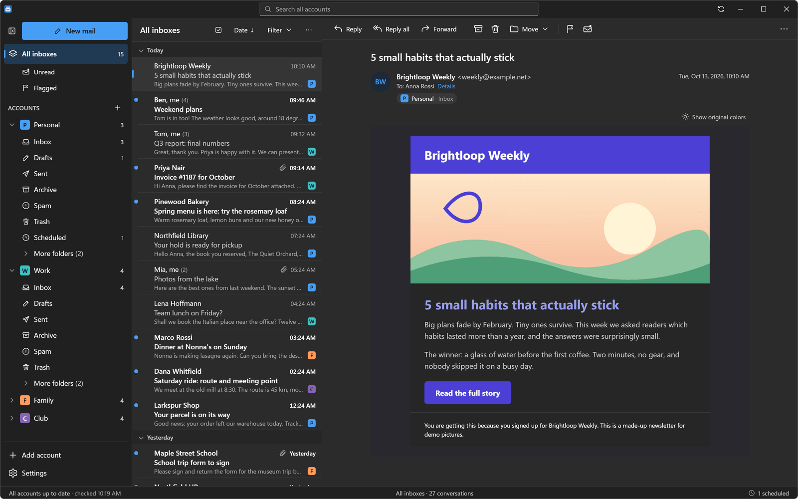
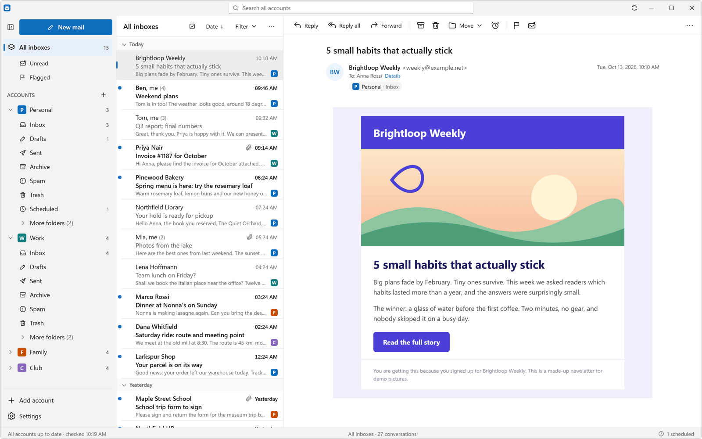
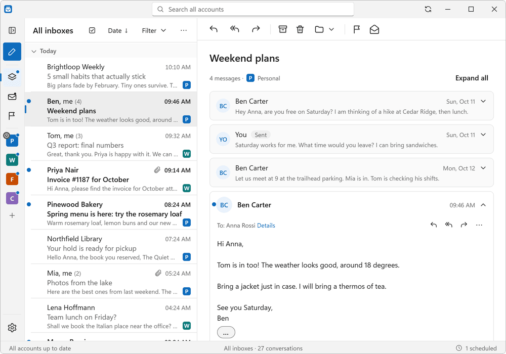
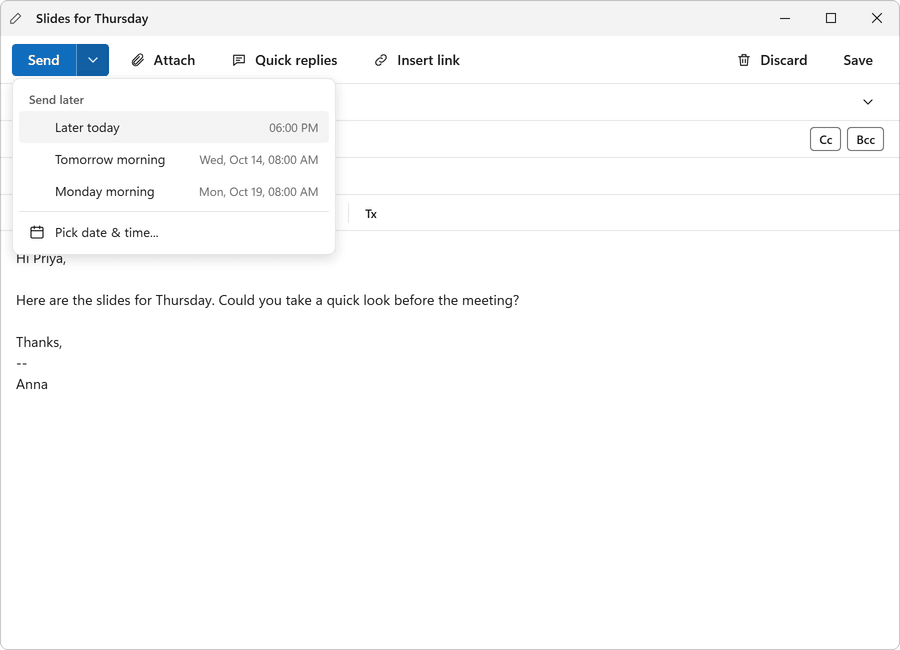
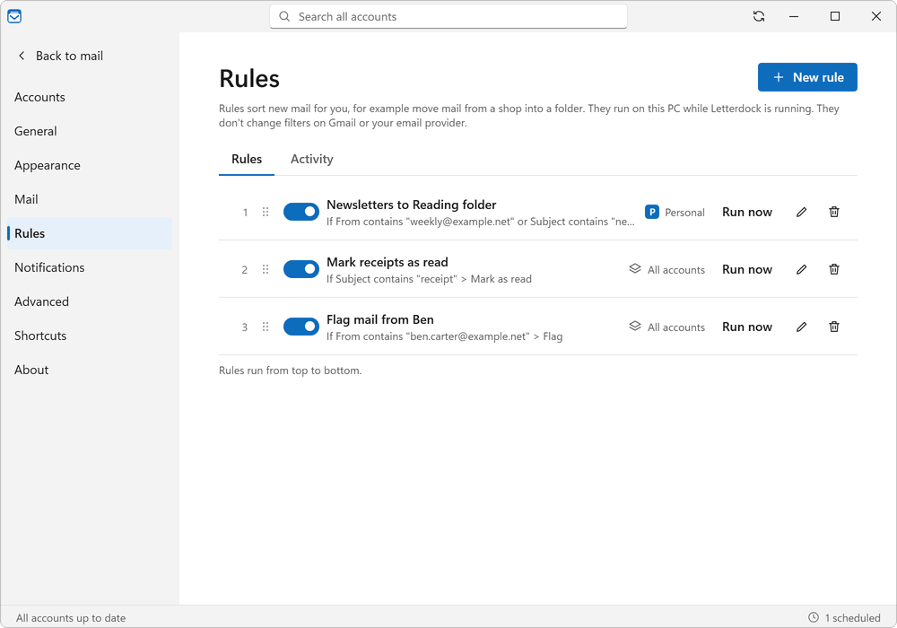
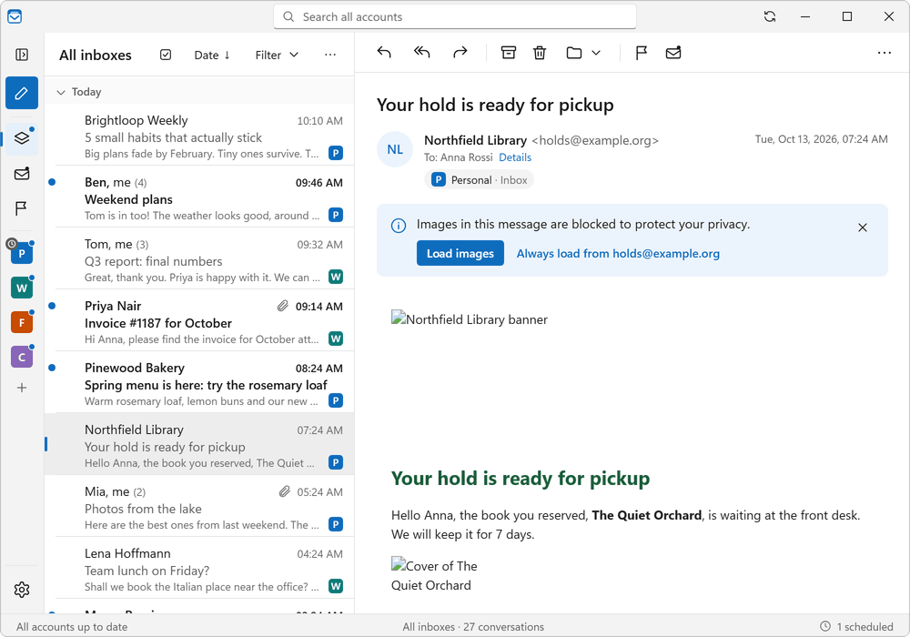
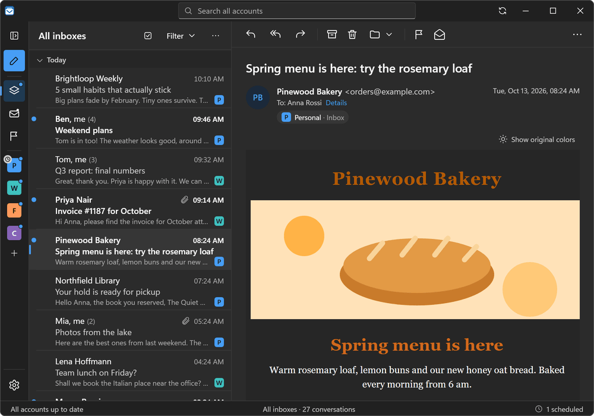
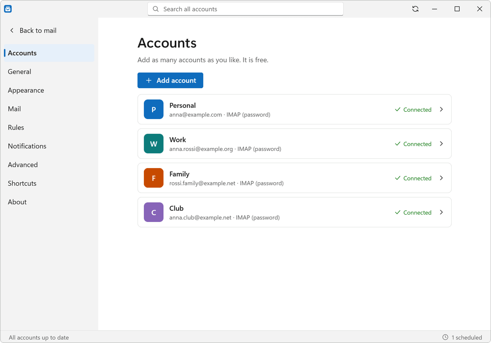

# Letterdock

_Letterdock was called Mailroom until version 0.2.9. Updating from 0.2.9 keeps your accounts, mail and settings and removes the old app._

A free, open-source email client for Windows. Add as many accounts as you like. No limits, no ads, no subscription.

Website: <https://voydapps.github.io/letterdock/>

Made by voyd.

## Features

- Unlimited email accounts (IMAP/SMTP), all in one place
- One inbox for all accounts, conversations, search across accounts
- Send later, rules that sort mail for you, and offline reading
- Dark mode for emails and blocked pictures until you allow them
- Automatic updates from GitHub Releases
- Your mail is stored on your own PC
- Opens `mailto:` links when you choose it as your default mail app
- Small installer, no admin rights needed

## Screenshots

<p align="center"><br><em>One inbox for all your accounts, here in dark mode.</em></p>

<p align="center"><br><em>The same window in light mode. Letterdock follows your Windows setting.</em></p>

|  |  |
|:---:|:---:|
| Replies grouped into conversations | Write now, send later |

|  |  |
|:---:|:---:|
| Rules sort your mail for you | Pictures are blocked until you allow them |

|  |  |
|:---:|:---:|
| Bright emails in dark mode | Add as many accounts as you like |

Website: <https://voydapps.github.io/letterdock/>

All pictures use made-up people and mail. Regenerate them with `npm run site:screenshots`.

## Download

Get the latest installer from the [Releases page](https://github.com/voydapps/letterdock/releases/latest). Download `Letterdock-Setup-<version>.exe` and run it.

The installer is not code-signed yet. Windows SmartScreen may show "Windows protected your PC". This is expected. Click **More info**, then **Run anyway**.

## Gmail: use an app password

Gmail does not accept your normal password in desktop mail apps. Use an app password instead:

1. Turn on 2-Step Verification in your Google account.
2. Open <https://myaccount.google.com/apppasswords> and create an app password named "Letterdock".
3. In Letterdock, add your Gmail address and paste the 16-letter app password.

## Outlook / Microsoft accounts

"Sign in with Microsoft" needs an app registration (client ID). It is coming. Until then, other IMAP accounts work as usual.

## Build from source

You need Node.js 24 (see `.nvmrc`) and Windows.

```
npm ci
npm run dev        # start the app with hot reload
npm run typecheck
npm run lint
npm test
npm run dist       # build the installer into release/
```

Local installer builds can be blocked by Windows Smart App Control. The official installers are built by GitHub Actions: bump the version in `package.json`, commit, then push a tag like `v0.2.6`. The installer appears on the Releases page.

Set `LETTERDOCK_DATA_DIR` to run with a throwaway data folder. Set `LETTERDOCK_MS_CLIENT_ID` to test "Sign in with Microsoft" with your own app registration.

## Privacy

Letterdock has no telemetry and no analytics, and no Letterdock servers. Your mail, accounts and settings stay on your PC (in `%APPDATA%\Letterdock`). Passwords are kept in Windows protected storage (DPAPI). The app talks to your own mail servers, to GitHub (to check for updates), to your email domain and Thunderbird's public settings list (to find server settings when you add an account), and to image servers only after you allow pictures.

## License

[MIT](LICENSE) (c) 2026 voyd
